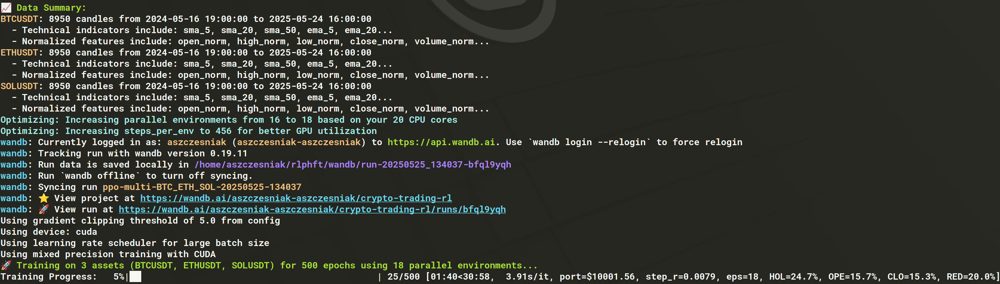
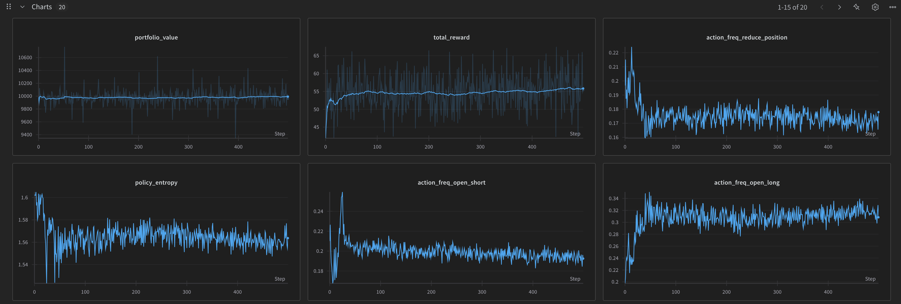

# Reinforcement Learning Powered Cryptocurrency Trading

This project applies reinforcement learning techniques to cryptocurrency trading using Binance market data. The system implements a Proximal Policy Optimization (PPO) agent that learns to make optimal trading decisions based on historical price data, technical indicators, and sentiment analysis.



## 🚀 Features

- **Reinforcement Learning Trading**: PPO agent optimized for cryptocurrency trading
- **Multi-Asset Support**: Trade multiple cryptocurrencies (BTC, ETH, SOL, BNB, XRP)
- **Technical Analysis**: 30+ technical indicators including SMA, EMA, RSI, MACD, Bollinger Bands
- **Sentiment Analysis**: Integration with Santiment API for social and market sentiment data
- **Performance Tracking**: Weights & Biases integration for experiment tracking
- **Hardware Optimization**: GPU acceleration and mixed precision training
- **Comprehensive Evaluation**: Compare against random and buy-and-hold strategies
- **Flexible Configuration**: Centralized configuration system with environment overrides



## 📋 Prerequisites

- Python 3.10 or higher
- CUDA-compatible GPU (optional, for accelerated training)
- Binance API access (optional, for live data)
- Santiment API key (optional, for sentiment analysis)
- Weights & Biases account (optional, for experiment tracking)

## 🛠️ Installation

1. Clone the repository:

```bash
git clone <repository-url>
cd rlphft
```

2. Install dependencies:

```bash
pip install -r requirements.txt
```

3. Configure API keys (optional):

```bash
cp config.env.example config.env
# Edit config.env with your API keys
```

## 🏃 Quick Start

### Basic Usage

```bash
# Run with default settings (loads pre-trained model if available)
python3 main.py

# Train a new model
python3 main.py --train

# Evaluate the model
python3 main.py --evaluate
```

### Training Options

```bash
# Train on specific cryptocurrencies
python3 main.py --symbols BTCUSDT ETHUSDT SOLUSDT --train

# Fast training mode (fewer epochs for quick iterations)
python3 main.py --train --fast_train

# Full training mode (complete training for best results)
python3 main.py --train --full_train

# Use specific amount of historical data
python3 main.py --lookback_days 365 --train

# Enable hardware optimization and mixed precision
python3 main.py --train --optimize --mixed_precision
```

### Evaluation Options

```bash
# Evaluate on a specific symbol
python3 main.py --eval_symbol ETHUSDT

# Evaluate on a random symbol
python3 main.py --eval_random

# Evaluate on all available symbols
python3 main.py --eval_all

# Set number of evaluation episodes
python3 main.py --episodes 10

# Specify initial crypto allocation (0.0 to 1.0)
python3 main.py --initial_allocation 0.5
```

### Advanced Features

```bash
# Enable sentiment analysis (requires Santiment API key)
python3 main.py --sentiment

# Enable Weights & Biases tracking
python3 main.py --wandb

# Force refresh of cached data
python3 main.py --force_refresh

# Test with Binance testnet (requires API setup)
python3 main.py --testnet
```

## 📊 Performance

The RL agent has been trained on multiple cryptocurrency pairs with varying market conditions. Key performance metrics include:

- **Training Environment**: 1-week episodes with 1-hour candles
- **State Space**: Technical indicators + sentiment data + portfolio state
- **Action Space**: 5 discrete actions (hold, buy/sell at different percentages)
- **Reward Function**: Portfolio value change with transaction cost penalties

## 🔧 Configuration

The project uses a centralized configuration system in `config.py` with the following hierarchy:

1. **Default values** in `Config` class
2. **Environment variables** from `config.env` file
3. **Command line arguments** override both

### Key Configuration Options

- **Trading Parameters**: Symbols, timeframes, commission rates
- **Training Settings**: Epochs, batch size, learning rate, model architecture
- **Environment Setup**: Episode length, observation window, initial balance
- **API Integration**: Binance and Santiment API keys
- **Hardware Settings**: GPU optimization, mixed precision training

### Setting Up API Keys

Create a `config.env` file (copy from `config.env.example`):

```bash
# Binance API configuration
BINANCE_API_KEY=your_binance_api_key_here

# Santiment API key (for sentiment analysis)
SANTIMENT_API_KEY=your_santiment_api_key_here

# Weights & Biases (for experiment tracking)
WANDB_PROJECT=your-project-name
WANDB_TEAM=your-team-name
```

## 📁 Project Structure

```
├── main.py                    # Main entry point
├── config.py                  # Configuration system
├── config.env.example         # Example configuration file
├── requirements.txt           # Python dependencies
│
├── agent.py                   # PPO agent implementation
├── trading_env.py             # Trading environment (Gymnasium-compatible)
├── training.py                # Training functions and utilities
├── evaluation.py              # Evaluation and backtesting
│
├── data_fetcher.py            # Binance data fetching
├── santiment_api.py           # Sentiment data from Santiment
├── technical_indicators.py    # Technical analysis indicators
├── utils.py                   # Utility functions
├── visualization.py           # Data visualization tools
│
├── tools/                     # Additional tools and examples
│   ├── cartpole.py           # CartPole RL example
│   └── visualize_indicators.py # Technical indicator visualization
│
├── images/                    # Documentation images
├── data_cache/               # Cached market and sentiment data
└── saved_model_*.pt          # Pre-trained models
```

## 🧠 Technical Approach

### Reinforcement Learning

- **Algorithm**: Proximal Policy Optimization (PPO)
- **Network Architecture**: Multi-layer perceptron with configurable hidden dimensions
- **Training**: Parallel environments with GPU acceleration
- **Exploration**: Entropy regularization for action space exploration

### Feature Engineering

1. **Technical Indicators**: Moving averages, momentum oscillators, volatility measures
2. **Market Microstructure**: Volume, spread, and order book features
3. **Sentiment Signals**: Social media sentiment, developer activity, exchange flows
4. **Portfolio State**: Current allocation, performance metrics, position sizing

### Environment Design

- **State Space**: Normalized technical indicators + portfolio state
- **Action Space**: Discrete actions for position management
- **Reward Function**: Risk-adjusted returns with transaction cost penalties
- **Episode Structure**: Weekly trading sessions with hourly decision points

## 📈 Sentiment Analysis Integration

The project integrates with Santiment's API to incorporate market sentiment data:

### Available Metrics

- **Social Sentiment**: Twitter sentiment analysis for cryptocurrencies
- **Social Volume**: Discussion volume across social platforms
- **Social Dominance**: Relative discussion share vs other assets
- **Developer Activity**: GitHub commits and development metrics
- **Exchange Flows**: On-chain transaction analysis

### Setup

1. Create account at [Santiment](https://santiment.net/)
2. Get API key from dashboard
3. Add to `config.env`: `SANTIMENT_API_KEY=your_key_here`
4. Enable with `--sentiment` flag

## 🔐 Security & Authentication

### SSH Key Authentication

The project uses Ed25519 SSH keys for Binance API authentication:

- More secure than traditional API key/secret pairs
- Uses key from `~/.ssh/id_ed25519` by default
- API requests signed with cryptographic signatures

### Data Privacy

- All sensitive configuration in `config.env` (gitignored)
- No hardcoded credentials in source code
- Cached data contains only public market information

## 🤝 Contributing

1. Fork the repository
2. Create a feature branch
3. Make your changes
4. Add tests if applicable
5. Submit a pull request

## 📄 License

This project is provided as-is for educational and research purposes. Please ensure compliance with exchange APIs' terms of service when using for trading.

## ⚠️ Disclaimer

This software is for educational purposes only. Cryptocurrency trading involves substantial risk of loss. Past performance does not guarantee future results. Use at your own risk.

## 🔗 Related Tools

- **CartPole Example**: `tools/cartpole.py` - Simple RL example for learning
- **Indicator Visualization**: `tools/visualize_indicators.py` - Technical analysis charts
- **Environment Testing**: `test_env.py` - Trading environment validation
